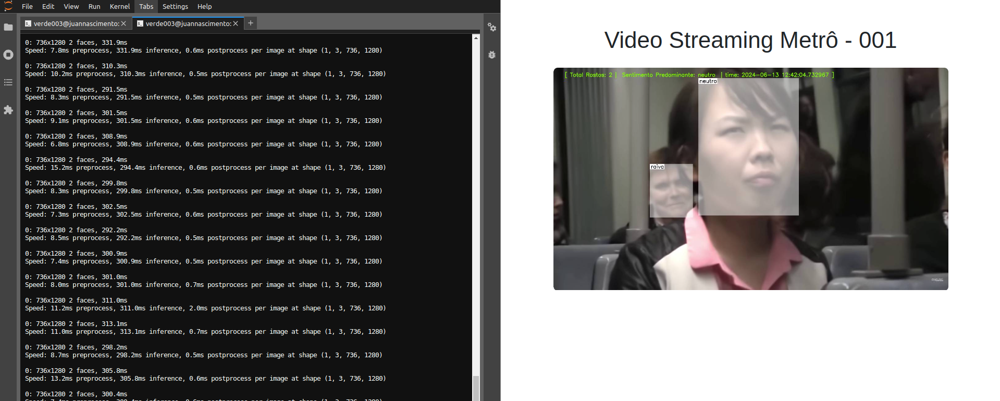

# Video-Emotion-Analysis-System


| Output                                   | Output                                    |
|--------------------------------------------|--------------------------------------------|
|          |          |

| Output                                   | Output                                    |
|--------------------------------------------|--------------------------------------------|
|          |          |


## Demo 

**Video Completo** - https://youtu.be/aaEWrjiB-y4

Este projeto implementa um sistema capaz de analisar um vídeo, identificando mudanças de humor em pessoas, especificamente capturando momentos de riso, neutro e tristeza. Utiliza detecção de rostos, reconhecimento de emoções faciais e gera um vídeo de saída com as emoções identificadas.

## Instalação

Para instalar e usar este projeto, siga os passos abaixo:

1. **Clone o repositório:**

``` bash
   git clone https://github.com/juanengml/Video-Emotion-Analysis-System.git
   cd Video-Emotion-Analysis-System
```


Instale as dependências:

2. **Recomenda-se usar um ambiente virtual para isolar as dependências do projeto. Com virtualenv:**

``` bash
python -m venv venv
source venv/bin/activate   # No Windows use `venv\Scripts\activate`
pip install -r requirements.txt
```

3. **Baixe o modelo YOLOv8 para detecção de rostos:**

Baixe o arquivo yolov8n-face.pt do repositório:

[Modelo YOLOv8 para detecção de rostos](https://github.com/akanametov/yolov8-face/releases/download/v0.0.0/yolov8n-face.pt)

4. **Coloque o arquivo baixado na raiz do diretório emotion_analysis.**

``` bash
python runner/main.py
```

5. **Output Terminal**
``` bash

0: 736x1280 2 faces, 310.4ms
Speed: 9.6ms preprocess, 310.4ms inference, 0.7ms postprocess per image at shape (1, 3, 736, 1280)
^C * Serving Flask app 'flask_opencv_streamer.streamer_3031'
 * Debug mode: off

WARNING: This is a development server. Do not use it in a production deployment. Use a production WSGI server instead.
 * Running on all addresses (0.0.0.0)
 * Running on http://127.0.0.1:3031
 * Running on http://192.168.0.60:3031
Press CTRL+C to quit
0: 736x1280 2 faces, 277.8ms
Speed: 11.9ms preprocess, 277.8ms inference, 0.5ms postprocess per image at shape (1, 3, 736, 1280)

Timestamp: 2024-06-13 11:16:03.157902 - Emotion: alegria
Timestamp: 2024-06-13 11:16:03.240949 - Emotion: None
Timestamp: 2024-06-13 11:16:03.798737 - Emotion: alegria
Timestamp: 2024-06-13 11:16:04.313833 - Emotion: alegria
Timestamp: 2024-06-13 11:16:04.819462 - Emotion: alegria
Timestamp: 2024-06-13 11:16:05.361431 - Emotion: alegria
Timestamp: 2024-06-13 11:16:05.879322 - Emotion: alegria
Timestamp: 2024-06-13 11:16:06.503813 - Emotion: alegria
Timestamp: 2024-06-13 11:16:06.570672 - Emotion: None
Timestamp: 2024-06-13 11:16:07.097849 - Emotion: alegria
Timestamp: 2024-06-13 11:16:07.164388 - Emotion: None
Timestamp: 2024-06-13 11:16:07.681876 - Emotion: alegria
Timestamp: 2024-06-13 11:16:07.744584 - Emotion: None
Timestamp: 2024-06-13 11:16:08.250940 - Emotion: alegria
Timestamp: 2024-06-13 11:16:08.750569 - Emotion: alegria
Timestamp: 2024-06-13 11:16:09.231641 - Emotion: alegria
Timestamp: 2024-06-13 11:16:09.717743 - Emotion: alegria
Timestamp: 2024-06-13 11:16:10.216144 - Emotion: alegria
Timestamp: 2024-06-13 11:16:10.743539 - Emotion: alegria
```



